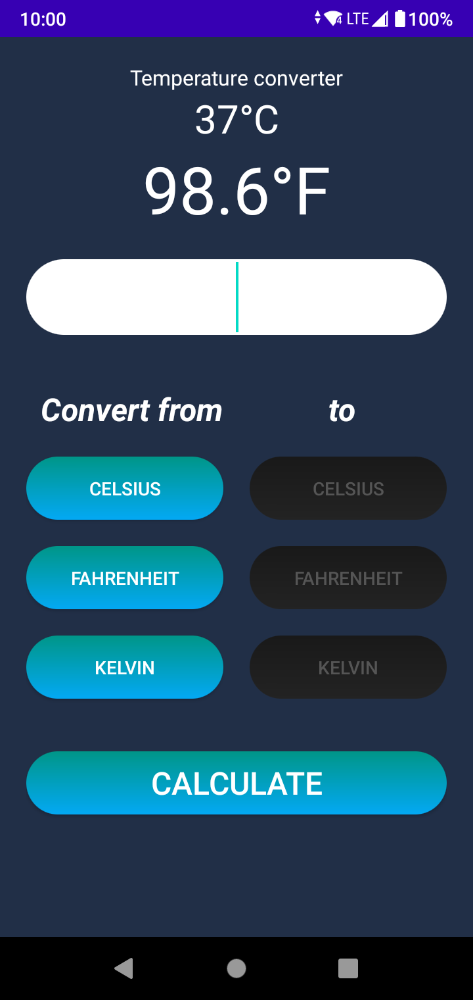

<h1 align="center">
  Projeto  003 - Conversor de temperatura
</h1>

  Este é um projeto simples para treinamento de alguns conceitos de Kotlin.
  Assim que for avançando no aprendizado de desenvolvimento de aplicativos para Android estarei melhorando toda a estrutura do código.

  Link para a documentação do projeto: <!--<a href="#">--><b>Em atualização!</b><!--</a>-->

  <b>Tela do aplicativo em uso</b>

  

